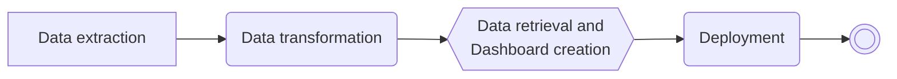

# PhonePe-Pulse-Data-Visualization
Capstone Project Assigned by Guvi Institute.

 

 ```
The open-source platform for visualizing PhonePe pulse insights.
```

 ## PhonePe Pulse ##

> PhonePe Pulse is your window to the world of how India transacts with interesting trends, deep insights and in-depth analysis based on data put together by the PhonePe team. The goal is to extract this data and process it to obtain insights and information that can be visualized in a user-friendly manner.

### Tools and Libraries Required :


| Tool/Lib | Purpose |
| --- | --- |
| Python | Using scripting language such as Python, along with libraries such as Pandas, to manipulate and pre-process the data. This may include cleaning the data, handling missing values, and transforming the data into a format suitable for analysis and visualization. |
| PostgresSQL | Use the "Psycopg2" library in Python to connect to a PostgresSQL database and insert the transformed data using SQL commands |
| Streamlit and Plotly | Using the Streamlit and Plotly libraries in Python to create an interactive and visually appealing dashboard. Plotly's built-in geo map functions can be used to display the data on a map and Streamlit can be used to create a user-friendly interface with multiple dropdown options for users to select different facts and figures to display. |

## Steps involved for this project :



